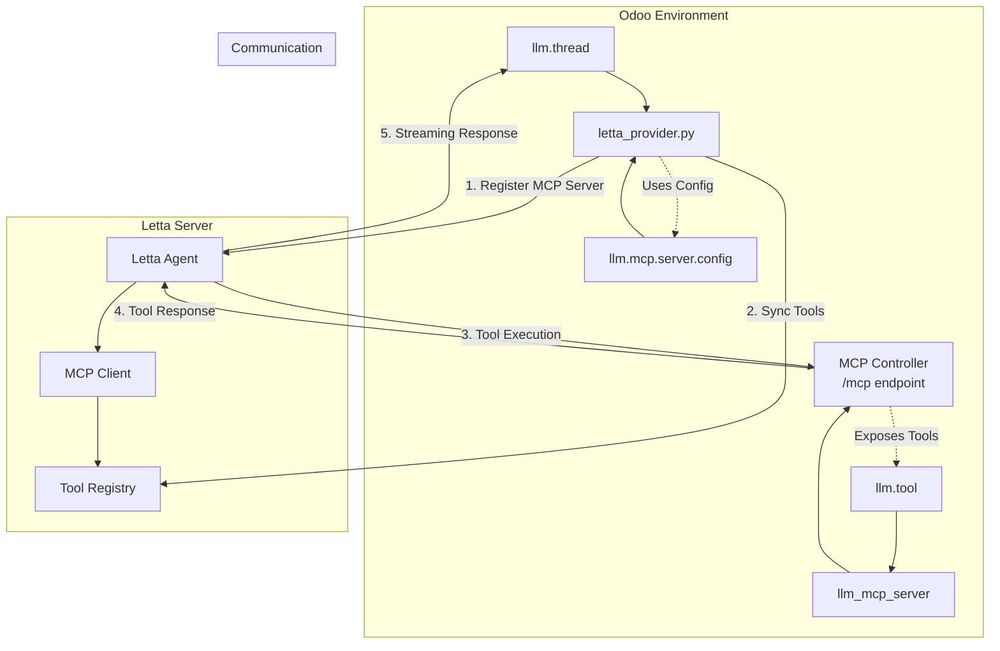

# LLM Letta Integration Technical Guide

## Overview

The `llm_letta` module integrates Letta AI agents with Odoo's LLM framework. Letta provides stateful agents with persistent memory and MCP (Model Context Protocol) tool access.

**Key Concepts:**
- **One agent per thread**: Each Odoo thread gets a dedicated Letta agent
- **Server-side memory**: Letta maintains conversation history (Odoo only sends latest message)
- **MCP authentication**: Auto-generated per-user API keys for secure tool access
- **Agent lifecycle**: Automatic creation, updates, and cleanup

**Requirements:**
- **Letta Server**: Version 0.11.7+ (earlier versions have MCP bugs)
- **Letta Client**: Forked version required (fixes `listembeddingmodels()` bug)
  ```bash
  pip install git+https://github.com/apexive/letta-python.git@main
  ```
  _See [Issue #25](https://github.com/letta-ai/letta-python/issues/25)_

## Architecture Components

### 1. Letta Provider (`letta_provider.py`)

**Responsibilities:**
- Agent creation and management
- Model fetching (chat + embedding models)
- Message streaming
- MCP server registration
- Tool synchronization (attach/detach)

**Key Methods:**
- `letta_get_client()` - Initialize Letta client
- `letta_models()` - Fetch available models
- `letta_chat()` - Stream agent responses
- `letta_sync_agent_tools()` - Sync thread tools to agent
- `letta_ensure_mcp_server()` - Register MCP server with Letta

### 2. Thread Integration (`llm_thread.py`)

**Responsibilities:**
- Agent lifecycle management (create, update, cleanup)
- API key generation and storage
- Memory block configuration
- Tool synchronization triggers

**Key Methods:**
- `_create_letta_agent()` - Create agent with memory blocks
- `_ensure_api_key_for_agent()` - Generate/retrieve API key
- `_cleanup_letta_resources()` - Delete agent and API key
- `_build_agent_config()` - Configure agent parameters

**Additional Fields:**
- `external_id` - Letta agent ID
- `metadata` - Stores API key and key ID (JSON field)

### 3. MCP Server Configuration

**Purpose:** Allows Letta agents to access Odoo tools securely

**Configuration:**
- External URL for Docker environments (`http://host.docker.internal:8069`)
- Per-user API key authentication
- Automatic server registration on first tool attachment

## Integration Flow



## Key Workflows

### 1. Agent Lifecycle

**Creation (on thread create or provider switch to Letta):**
```python
thread.create() / thread.write({'provider_id': letta_provider})
  → _create_letta_agent()
    → _build_agent_config()
      → _ensure_api_key_for_agent()  # Generate API key
        → Store in thread.metadata: {'api_key': '...', 'api_key_id': 123}
      → Create agent with memory blocks (persona, human)
      → Store agent.id in thread.external_id
    → letta_sync_agent_tools()  # Sync thread tools to agent
```

**Updates (on model/assistant change):**
```python
thread.write({'model_id': new_model})
  → _update_or_create_agent()
    → client.agents.modify(agent_id, model=new_model, system=system_prompt)
```

**Cleanup (on thread delete or provider change):**
```python
thread.unlink() / thread.write({'provider_id': other_provider})
  → _cleanup_letta_resources()
    → Delete res.users.apikeys record (using api_key_id from metadata)
    → client.agents.delete(agent_id)
    → Clear thread.metadata and thread.external_id
```

### 2. API Key Management

**Generation:**
- Created per thread with scope `rpc`
- Duration based on user's group settings (default: 90 days)
- Name format: `"Letta Agent - Thread {id}"`

**Storage:**
- API key value stored in `thread.metadata['api_key']`
- API key record ID stored in `thread.metadata['api_key_id']`
- Passed to Letta agent via `tool_exec_environment_variables`

**Usage:**
- Letta agent includes API key in MCP requests: `Authorization: Bearer {{ ODOO_API_KEY }}`
- Template variable replaced by Letta at runtime

### 3. MCP Server Registration

**First tool attachment triggers registration:**
```python
letta_attach_tool()
  → letta_ensure_mcp_server()
    → Get server URL from llm.mcp.server.config
    → Register with Letta:
      StreamableHttpServerConfig(
        server_name="odoo-mcp-server",
        server_url="http://host.docker.internal:8069/mcp",
        custom_headers={
          "Authorization": "Bearer {{ ODOO_API_KEY | system-api-key }}"
        }
      )
```

### 4. Tool Synchronization

**Triggered on `thread.tool_ids` change:**
```python
thread.write({'tool_ids': [(6, 0, [tool1, tool2])]})
  → letta_sync_agent_tools(agent_id, tool_records)
    → Get current agent tools (filter by tool_type="external_mcp")
    → Compare with desired tools
    → Attach new tools: letta_attach_tool()
    → Detach removed tools: letta_detach_tool()
```

### 5. Message Streaming

**Flow:**
```python
letta_chat(messages, stream=True)
  → Extract latest user message (Letta maintains history)
  → client.agents.messages.create_stream(agent_id, messages, stream_tokens=True)
  → Yield chunks: {"content": "..."}
  → Final chunk: {"content": "", "finish_reason": "stop"}
```

**Message Types:**
- `assistant_message` - Streamed to user ✅
- `reasoning_message` - Ignored (internal)
- `tool_call_message` - Ignored (future: show in UI)
- `tool_return_message` - Ignored (future: show in UI)
- `usage_statistics` - Ignored

## MCP Server Integration

### Available Tools

All active `llm.tool` records are exposed via MCP. Common tools:

- `odoo_record_retriever` - Search and retrieve Odoo records
- `odoo_record_creator` - Create new Odoo records
- `odoo_record_updater` - Update existing Odoo records
- `odoo_record_unlinker` - Delete Odoo records
- `odoo_model_method_executor` - Execute Odoo model methods
- `odoo_model_inspector` - Inspect Odoo model structure

### Tool Execution Flow

1. Letta agent decides to call a tool
2. MCP client in Letta sends HTTP request to `/mcp` endpoint
3. MCP controller authenticates via API key
4. Tool implementation executes in Odoo
5. Result returned via MCP protocol
6. Agent continues with tool result

## Configuration Examples

### Provider Setup

```python
# Local development (no API key needed)
provider = env['llm.provider'].create({
    'name': 'Letta (Local)',
    'service': 'letta',
    'api_base': 'http://localhost:8283',
})

# Letta Cloud
provider = env['llm.provider'].create({
    'name': 'Letta (Cloud)',
    'service': 'letta',
    'api_base': 'https://api.letta.com',
    'api_key': 'letta-cloud-token'
})
```

### MCP Server Configuration

```python
# For Docker environments - allow Letta to reach Odoo on host
mcp_config = env['llm.mcp.server.config'].get_active_config()
mcp_config.external_url = 'http://host.docker.internal:8069'
```

### Create Thread

```python
# Agent is created automatically
thread = env['llm.thread'].create({
    'provider_id': provider.id,
    'model_id': model.id,
    'tool_ids': [(6, 0, tool_ids)],  # Auto-synced to agent
})

# Agent ID stored in thread.external_id
# API key stored in thread.metadata
```

## Memory Configuration

### Default Memory Blocks

Agents are initialized with these memory blocks:

```python
memory_blocks = [
    {
        "label": "persona",
        "value": "I am a helpful AI assistant."
    },
    {
        "label": "human",
        "value": "The human's name is {user_name}."
    }
]
```

### Custom System Prompts

If thread has an assistant with a prompt template:

```python
if thread.assistant_id and thread.assistant_id.prompt_id:
    system_instruction = render_template(
        template=thread.assistant_id.prompt_id.template,
        context=thread.get_context()
    )
    agent_config["system"] = system_instruction
```

**Future Enhancement:** UI for editing memory blocks directly

## Error Handling

### Common Errors

- **MCP connection failure**: Check `external_url` in MCP config
- **Tool not found**: Ensure tool is active in `llm.tool`
- **Agent not found**: Agent may have been deleted externally
- **API key expired**: Keys expire based on user group settings

### Logging

Minimal logging to reduce noise:
- Agent deletion: `INFO` level
- Failed cleanup: `DEBUG` level (non-critical)

## Development Notes

### Docker Environment

When Letta runs in Docker:
- Set MCP `external_url` to `http://host.docker.internal:8069`
- Ensure Odoo port (8069) is accessible from container
- API key authentication handled automatically

### Adding New Tools

Tools are auto-available to agents:
1. Create/activate tool in `llm.tool`
2. Add to thread via `tool_ids`
3. Tool automatically synced to agent

### Testing

```python
# Test agent creation
thread = env['llm.thread'].create({
    'provider_id': letta_provider.id,
    'model_id': model.id,
})
assert thread.external_id  # Agent ID should be set

# Test API key generation
assert thread.metadata.get('api_key')
assert thread.metadata.get('api_key_id')

# Test cleanup
thread.unlink()
# Agent and API key should be deleted
```

## Limitations & Future Work

**Current Limitations:**
- Tool calls not visible in Odoo UI
- Memory blocks not editable from Odoo
- No shared memory across threads
- Usage statistics not tracked

**Planned Features:**
- Tool call visualization in message thread
- Memory block management UI
- Shared memory pools
- Advanced agent configuration (temperature, context window)
- Usage tracking and analytics
