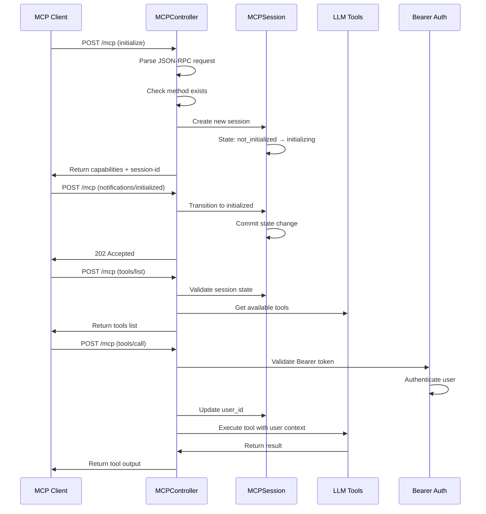
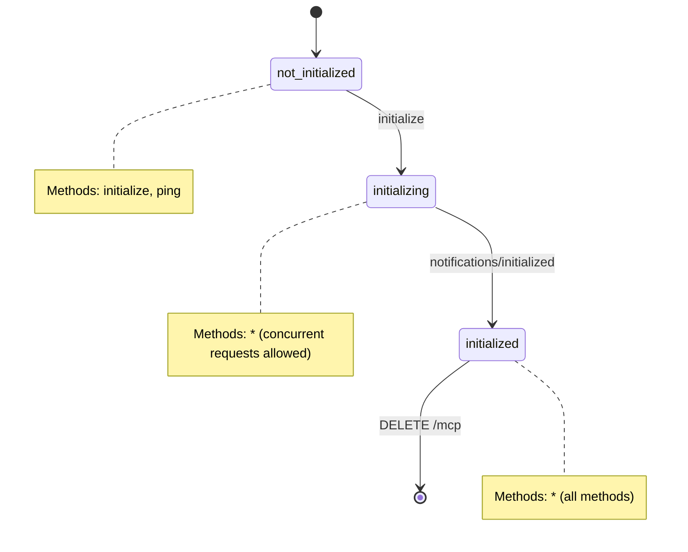

# MCP Server Technical Guide

## Architecture Overview

The MCP server implements a stateful JSON-RPC 2.0 server that bridges MCP clients with Odoo's LLM tool system.

### Core Components

- **MCPController**: HTTP endpoint handler (`/mcp`)
- **MCPSession**: Session state management model
- **MCPServerConfig**: Server configuration model
- **Bearer Auth**: API key authentication decorator

## Request Flow

## Session State Machine

## Key Design Decisions

### Concurrent Request Handling

- `initializing` state allows all methods to handle Claude Desktop's parallel discovery requests
- Explicit `session._cr.commit()` ensures immediate state visibility

### Authentication Flow

- `tools/call` requires Bearer authentication
- Session user_id updated on first authenticated request
- Tools execute with authenticated user's Odoo permissions

### Error Handling

- Early method validation prevents unnecessary session lookups
- JSON-RPC 2.0 compliant error responses
- Proper HTTP status codes (200 for JSON-RPC, 400/404 for transport errors)

## Performance Optimizations

1. **Method Existence Check**: `_is_callable()` validates handlers before session operations
2. **Indexed Lookups**: `session_id` field has database index for fast session retrieval
3. **Minimal Logging**: Production mode logs only warnings and authentication events
4. **State Transitions**: Direct database commits prevent race conditions

## Configuration

- **Mode**: Stateful (recommended) vs Stateless
- **Protocol Version**: Auto-negotiation with MCP 2025-06-18 support
- **External URL**: Override for Docker/container environments

## Security Model

- Bearer token authentication via Odoo's `res.users.apikeys`
- User context binding: `request.update_env(user=authenticated_user)`
- ACL enforcement: Tools respect Odoo's permission system
- Session isolation: Each session tracks its own user context
